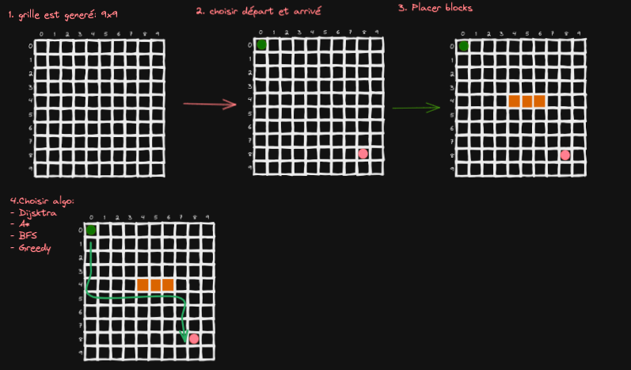

# Trinôme
identifiant : G2S1
Paris Felipe Mollo Christondis
Leopold Abignoli
Daniel Gilardoni

# Projet MD5
Projet Chemin, sujet 1

## Description du projet

Le projet consiste en une application graphique. Dans cette application, une grille sera generée, puis un point de départ et un point d'arrivé seront placé dans cette grille par l'utilisateur. 

L'utilisateur pourra placer (ou pas) des murs qui vont bloquer un chemin dans la grille. 
Ensuite l'utilisateur doit choisir un "algorithme de plus court chemin" parmis ceux qui seront proposés. Lorsque l'algorithme à été choisit, l'interface graphique affichera le chemin optimal calculé grâce à cette algorithme.

## Table des matières :

1. **Longueur et nombre de chemins de longueurs minimales dans une grille**  
Étudier la longueur et le nombre de chemin de longueur minimale dans une grille
(sans mur) de hauteur h et largeur l.  
Assigné à *Daniel Gilardoni*
2. **Borne maximale du nombre de chemins dans une grille**  
Donner une borne maximale du nombre de chemin dans une grille.  
Assigné à *Daniel Gilardoni* et *Leopold Abignoli*
3. **L'algorithme de parcours en largeur**  
Décrire l’algorithme de parcours en largeur.  
Assigné à *Leopold Abignoli* et *Paris Mollo*
4. **Programme calculant un des plus court chemin dans une grille**  
Écrire un programme qui prend en entrée un plan de ville représenté par un graphe issue d'une grille
où certaines arêtes ont été enlevées, et renvoie un des plus court chemin.  
Assigné à *Leopold Abignoli* et *Daniel Gilardoni*
5. **Complexité de l'algorithme calculant le plus court chemin**  
Calculer la complexité de l’algorithme calculant le plus court chemin dans un graphe issue d'une grille dans le pire des cas.
Comparer avec une méthode naïve qui ferait la liste des chemins de la grille avant d’enlever ceux bloqués
par des murs puis de prendre l’un des chemins restant de longueur minimale  
Assigné à *Paris Mollo* et *Daniel Gilardoni*

## Annexe
Une application graphique codé en java.
  1. Représentation des graphes (issue de grilles) dans le code : *Paris Mollo*
  2. Algorithmes implémentés :
    - Greedy : *Daniel Gilardoni*
    - A* : *Paris Mollo*
    - Dijkstra : *Leopold Abignoli*
    - Eventuellement d'autres algorithmes ou variantes : *Daniel Gilardoni*
  3. L'architecture du code : *Tous les membres*
  4. L'interface Graphique : *Leopold Abignoli* et *Paris Mollo*
  5. Animations : *Leopold Abignoli* et *Paris Mollo*
  6. Calculer et afficher la complexité des algorithmes dans le pire des cas, sachant que l’on travaille
  sur des graphes issus de grilles. : *Daniel Gilardoni*
